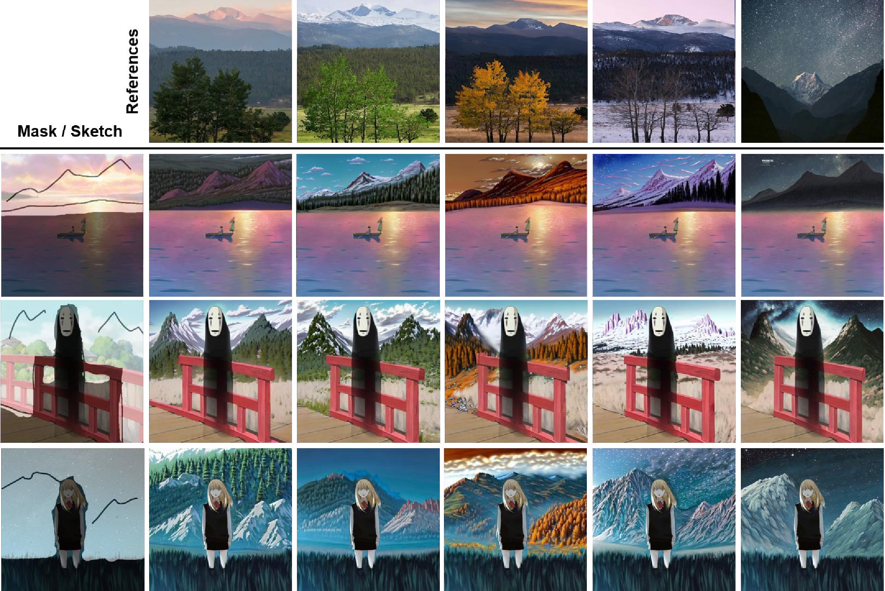
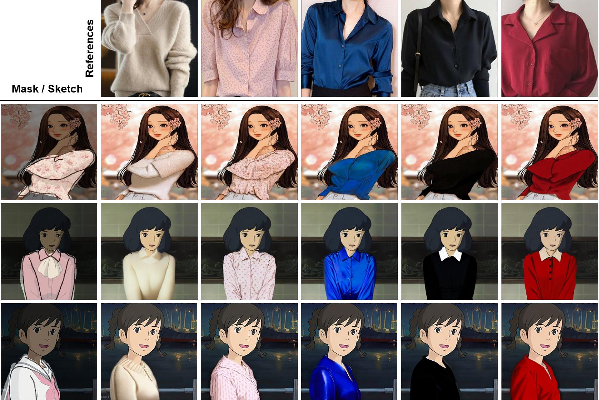
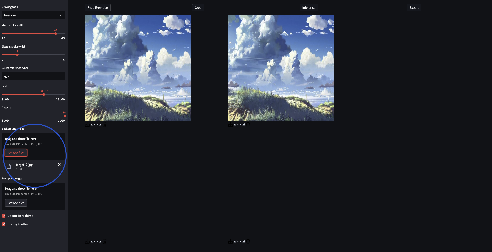
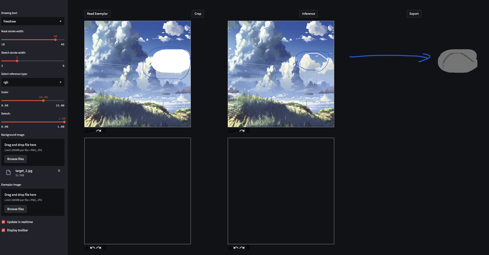
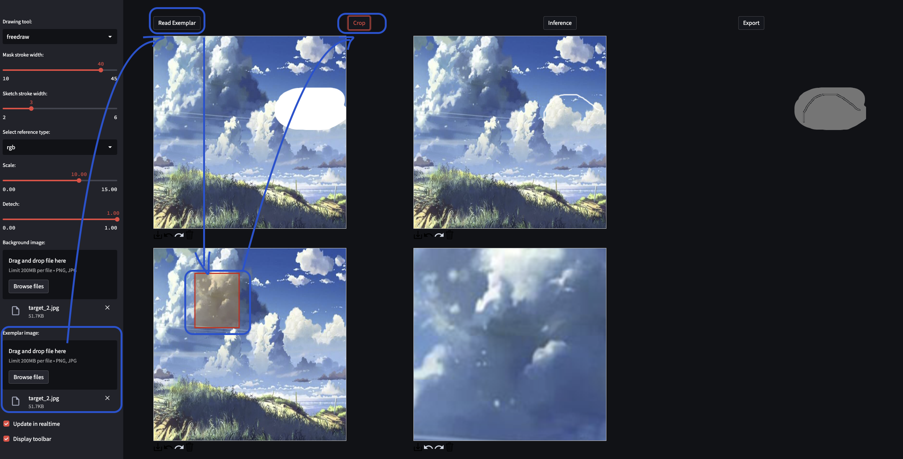
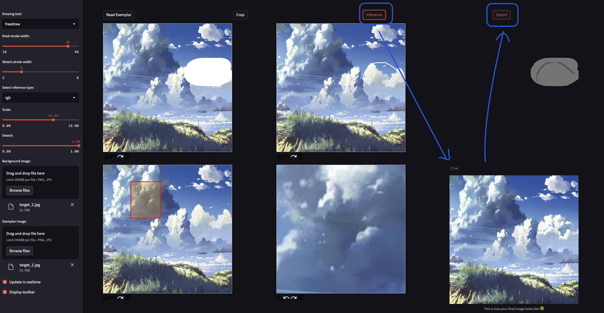

# Paint-by-Skech

### Teaser


### Multi-backgrounds


### Multi-references


## Abstract
>Recent remarkable improvements in large-scale text-to-image generative models have shown promising results in generating high-fidelity images. To further enhance editability and enable fine-grained generation, we introduce a multi-input-conditioned image composition model that incorporates a sketch as a novel modal, alongside a reference image. Thanks to the edge-level controllability using sketches, our method enables a user to edit or complete an image sub-part with a desired structure (i.e., sketch) and content (i.e., reference image). Our framework fine-tunes a pre-trained diffusion model to complete missing regions using the reference image while maintaining sketch guidance. Albeit simple, this leads to wide opportunities to fulfill user needs for obtaining the in-demand images.Through extensive experiments, we demonstrate that our proposed method offers unique use cases for image manipulation, enabling user-driven modifications of arbitrary scenes.
>

## Environment & Pre-trained models

### Dependancies

```
$ conda env create -f environment.yaml
$ conda activate paint_sketch
$ pip install torch==1.11.0+cu113 torchvision==0.12.0+cu113 torchaudio==0.11.0 --extra-index-url https://download.pytorch.org/whl/cu113
$ pip install opencv-python==4.6.0.66 opencv-python-headless==4.6.0.66 matplotlib==3.2.2 streamlit==1.14.1 streamlit-drawable-canvas==0.9.2
$ pip install git+https://github.com/openai/CLIP.git
```

### Download checkpoints
* [Google Drive](https://drive.google.com/file/d/1jCDamfsknQj-A28RMA6Blws8iQn0y1ez/view?usp=share_link)
* Place a downloaded file as below:
```
Paint-by-Sketch
    pretrained_models/
        model-modified-12channel.ckpt        
    models/
        Cartoon_v1_aesthetic/
            ...
    ...
```

## Data preparation

* Sketch extraction
```bash 
bash preprocess_dataset/run_preprocess.sh <path/to/image_root> <gpu_id>
# e.g., 
# bash preprocess_dataset/run_preprocess.sh /home/nas2_userF/kangyeol/Project/webtoon2022/Paint-by-Sketch/samples 7
```

* Result
```
IMAGE_ROOT
    images/
        000000.png
        000001.png
        ...
    sketch_bin/
        000000.png
        000001.png
        ...
    sketch(Not used)/
        ... 
    ...
```


## Training

```bash
bash cartoon_train.sh <gpu_ids> <path/to/logdir> <path/to/config>

# e.g,
# bash cartoon_train.sh 0,1 models/test configs/v1_aesthetic_sketch_image.yaml
```

* You need to match the number of `gpu_ids` and the number of gpus in the `lightning.trainer.yaml` (`gpu_ids`=2,3 with '0,1' in config file).

## Demo

0. Running `streamlit` server 
```bash
streamlit run demo/app.py --server.port=8507 --server.fileWatcherType none
```

1. Upload the source image
<p align="center">
  
</p>

2. Draw mask and sketch separately
<p align="center">
  
</p>

* The 1st and 2nd canvases are panels where you can draw masks and sketches.<br>
* In the 3rd canvas, you can view the drawn mask and sketch overlaid together.<br>


3. Upload a reference image.
<p align="center">
  
</p>

* Select a image in the left panel.<br>
* Click `Read Exemplar` button.<br>
* Crop the image partially with bounding box.<br>

4. Inference and export
<p align="center">
  
</p>

* Perform inference with the drawn mask, sketch, and the cropped image as conditions. <br>
* You can adjust the `scale` and `sketch strength` in the left panel.<br>
* ou can save images in grid format through `Export` button.<br>

## Issues

* If the screen size is not large enough and the canvas size changes, there will be misalignment in the drawn mask and sketch.

## Acknowledges
This code borrows heavily from [Stable Diffusion](https://github.com/CompVis/stable-diffusion) and [Paint-by-Example](https://github.com/Fantasy-Studio/Paint-by-Example).